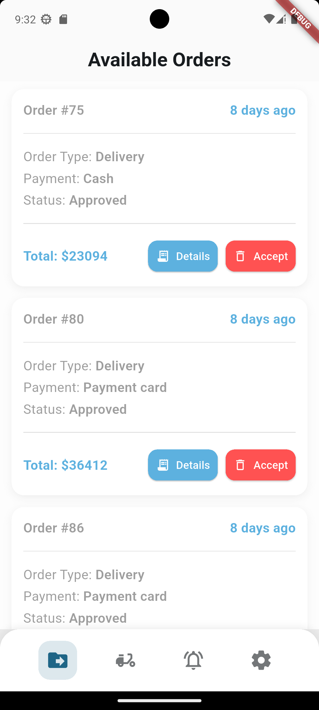
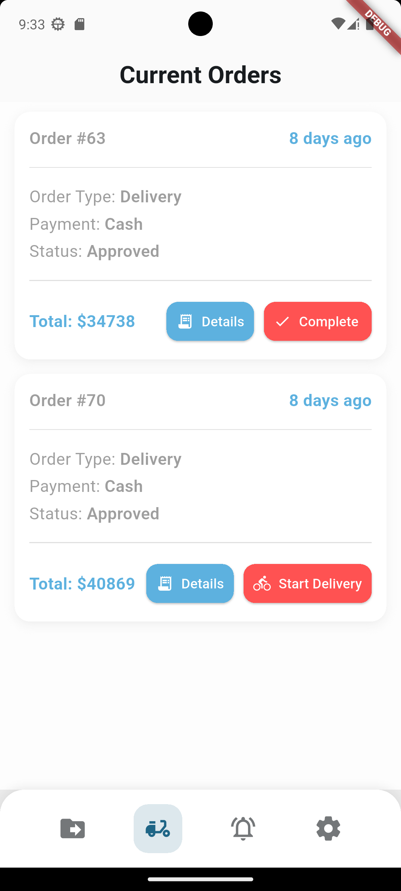
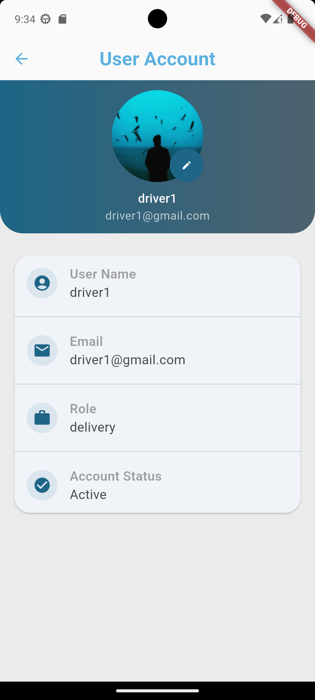
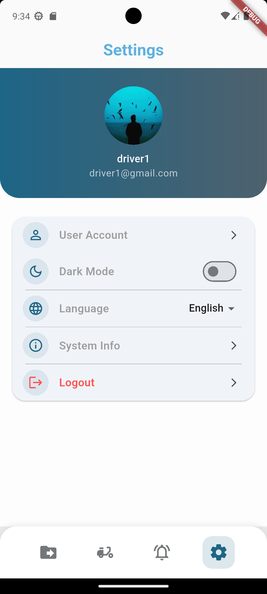

# Ecommerce Delivery App (Flutter)

Delivery application for drivers to manage assigned orders.

## Features
- Driver authentication
- View assigned orders
- Update order status (picked up, delivered)
- API integration

## Tech Stack
- Flutter
- Dart
- REST API
- GetX

## Screenshots

## Related Repositories
- Backend API:[link](https://github.com/osamajmt/ecommerce-api-laravel)
- Driver App: [link](https://github.com/osamajmt/ecommerce-customer-flutter)
- Admin App: [link](https://github.com/osamajmt/ecommerce-admin-flutter)